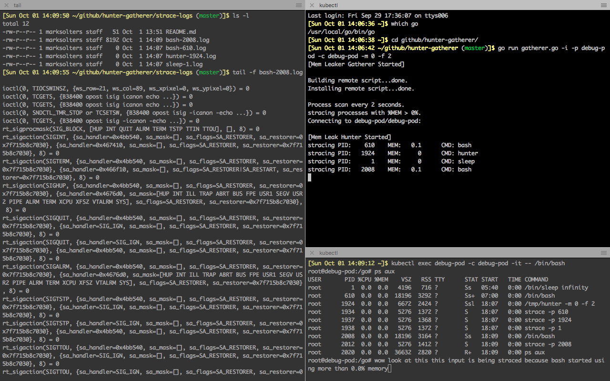

# hunter-gatherer
`strace` debugging for memory leaks in Kubernetes containers and who wanna learn to debug other containers good, too.

You can pass this tool a Kube pod name, container name, and memory threshold, and it will create realtime `strace` log files on your local dev machine for all processes on the target container that are exceeding the memory threshold!



## Quick Start
On your development machine:

```bash
gatherer -i -p problempod -c buggycontainer -m 50.0 -f 2
```

Here's what will happen: Every `2` seconds, processes inside `problempod/buggycontainer` which are using more than `50.0%` memory will be `straced`.  The results will end up in `strace-logs/<cmdname>-<pid>.log`.  You can tail these files as they're written.

In more detail, what happens is:

*  The `hunter` program will be built and copied to your target container
*  The `hunter` program will begin polling for processes on the target container using, in this case, over `50.0%` memory every `2` seconds.
*  `strace` will be called on each offending process, and the data will be streamed back to `gatherer` running on your local machine
*  The incoming data will be redirected to local log files located in the `strace-logs/` directory.  Each file will have both the human-readable name of the command being logged as well as its PID.

You can CTRL-C out of `gatherer` to exit, which will sync local storage as well as (attempt to) close down `hunter` on the target container.  This almost always works!  However, sometimes `kubectl` can lag out or barf, in which case you may have to manually manage any zombie processes.

## Requirements
Local machine:
*  Golang environment (you can run `hunter` with `go build` and execute, or just `go run`)
*  `kubectl`, authed for your target pods and containers.  `gatherer` will use `kubectl` to `exec` and `cp` with the target container.

Target machine:
*  `top`
*  `strace` (this can be tricky inside containers, see below)

## Arguments
Arg | Description | Priority
---|---|---
-p | Name of target pod | required
-c | Name of target container | required
-i | Include this argument to copy `hunter` to target container | optional, but must be run at least once, default false
-m | Memory usage threshold.  Value interpreted as a percentage.  Example values are like 50.0 or 12.3 etc. Processes on the target container exceeding this memory threshold will begin to be `straced` back to the `gatherer` app. | optional, default 2.0
-f | Scan frequency, in seconds.  Whatever integer is provided here is how many seconds will pass between each scan of the running processes to determine if any are violating the memory threshold. | optional, default 5

## Target Architecture
Out-of-the-box `hunter` will assume the target container is a 64-bit Linux image.  If this isn't the case, make sure to update `GOOS` and `GOARCH` inside `build-hunter.sh`!

## Enable strace in a Kube Container
By default, most Kube pods will not allow `strace` out-of-the-box.  In fact, most common container images won't even have it installed.

But even with `strace` installed, you may find yourself getting error messages like this:

```
root@ubunt17-3503596890-f4m4v:/# strace -p 1
strace: attach: ptrace(PTRACE_ATTACH, ...): Operation not permitted
Could not attach to process.  If your uid matches the uid of the target
process, check the setting of /proc/sys/kernel/yama/ptrace_scope, or try
again as the root user.  For more details, see /etc/sysctl.d/10-ptrace.conf
```

What this means is that the container itself needs the `SYS_ADMIN` and `SYS_PTRACE` capabilities to be enabled for `strace` to function.  If this was a simple local Docker container, we could just modify our Docker command:

```bash
docker run -t --pid=container:caddy \
  --net=container:caddy \
  --cap-add sys_admin \
  --cap-add sys_ptrace \
  strace
```
(Above command taken from a [great article by Justin Garrison](https://medium.com/@rothgar/how-to-debug-a-running-docker-container-from-a-separate-container-983f11740dc6))

To do this with Kubernetes, however, we need to modify our container capabilities by changing our .yaml definitions ([see docs](https://kubernetes.io/docs/tasks/configure-pod-container/security-context/#set-capabilities-for-a-container)).  Here's an example:

```yaml
apiVersion: v1
kind: Pod
metadata:
  name: debug-pod
spec:
  containers:
  - name: debug-pod
    image: "golang:stretch"
    command:
      - /bin/sleep
      - "infinity"
    securityContext:
      capabilities:
        add: ["SYS_ADMIN", "SYS_PTRACE"]
```

So if we create a pod like this, we can `exec` in, install `strace`, and start debugging no problem:

```bash
msolters@localhost:~/go/src/hunter-gatherer$ kubectl create -f strace-pod.yaml
pod "debug-pod" created
msolters@localhost:~/go/src/hunter-gatherer$ kubectl exec debug-pod -it -- /bin/bash
root@debug-pod:/go# apt-get update
Ign:1 http://deb.debian.org/debian stretch InRelease
Get:2 http://deb.debian.org/debian stretch-updates InRelease [91.0 kB]
Get:3 http://security.debian.org stretch/updates InRelease [62.9 kB]
Get:4 http://deb.debian.org/debian stretch Release [118 kB]                        
Get:5 http://deb.debian.org/debian stretch Release.gpg [2373 B]                    
Get:6 http://deb.debian.org/debian stretch-updates/main amd64 Packages [5553 B]
Get:7 http://security.debian.org stretch/updates/main amd64 Packages [215 kB]
Get:8 http://deb.debian.org/debian stretch/main amd64 Packages [9497 kB]
Fetched 9992 kB in 1s (5241 kB/s)                        
Reading package lists... Done
root@debug-pod:/go# apt-get install strace
Reading package lists... Done
Building dependency tree       
Reading state information... Done
The following NEW packages will be installed:
  strace
0 upgraded, 1 newly installed, 0 to remove and 8 not upgraded.
Need to get 533 kB of archives.
After this operation, 1396 kB of additional disk space will be used.
Get:1 http://deb.debian.org/debian stretch/main amd64 strace amd64 4.15-2 [533 kB]
Fetched 533 kB in 0s (3320 kB/s)
debconf: delaying package configuration, since apt-utils is not installed
Selecting previously unselected package strace.
(Reading database ... 15063 files and directories currently installed.)
Preparing to unpack .../strace_4.15-2_amd64.deb ...
Unpacking strace (4.15-2) ...
Setting up strace (4.15-2) ...
root@debug-pod:/go# strace -p 1
strace: Process 1 attached
restart_syscall(<... resuming interrupted nanosleep ...>
```

If you're using `strace` to debug memory leaks in a Kube deployment that can't be inferred from other logs, you've clearly got issues my friend.  It shouldn't be too much extra work to reconfigure your pods to be debuggable if it helps you track down the real problem!
